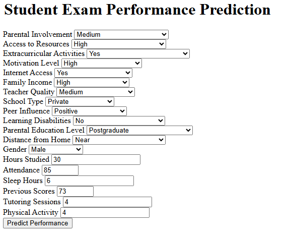

Project Description :-

This project analyzes student performance data to identify factors that influence exam scores. The dataset contains various features, such as hours studied, attendance, parental involvement, access to resources, extracurricular activities, sleep hours, and more. The goal is to understand how these factors contribute to student performance and to build a predictive model that can forecast exam scores based on these features.

Problem Statement:-

Understanding the factors that impact student performance is critical for educators, parents, and policymakers. With this dataset, we aim to investigate how different aspects of a student's life—ranging from family background and personal habits to school-related factors—affect their exam outcomes. Specifically, this project seeks to answer the following questions:

  1-What are the most influential factors in determining a student's exam score?

  2-How can schools and parents support students to maximize their performance?

Dataset Features:-

The dataset includes the following features:

 1-Hours_Studied: Number of hours a student spends studying.

 2-Attendance: A measure of a student's school attendance.

 3-Parental_Involvement: Level of parental involvement in the student's education.

 4-Access_to_Resources: Availability of educational resources to the student.

 5-Extracurricular_Activities: Participation in extracurricular activities.

 6-Sleep_Hours: Average number of hours of sleep per night.

 7-Previous_Scores: Previous academic scores or grades.

 8-Motivation_Level: Student's motivation level.

 9-Internet_Access: Availability of internet access at home.

 10-Tutoring_Sessions: Number of tutoring sessions attended.

 11-Family_Income: Family’s income level.

 12-Teacher_Quality: Quality of teachers as perceived or rated.

 13-School_Type: Type of school (e.g., public or private).

 14-Peer_Influence: Influence of peers on the student's performance.

 15-Physical_Activity: Level of physical activity.

 16-Learning_Disabilities: Any reported learning disabilities.

 17-Parental_Education_Level: Education level of the student's parents.

 18-Distance_from_Home: Distance of school from the student’s home.

 19-Gender: Gender of the student.

 20-Exam_Score: The target variable representing the student's exam score.
 

Objective:-

The main objective is to create a predictive model that uses these features to estimate exam scores. By identifying significant factors, we can provide actionable insights for improving 
student performance.

WEb UI and Input-

